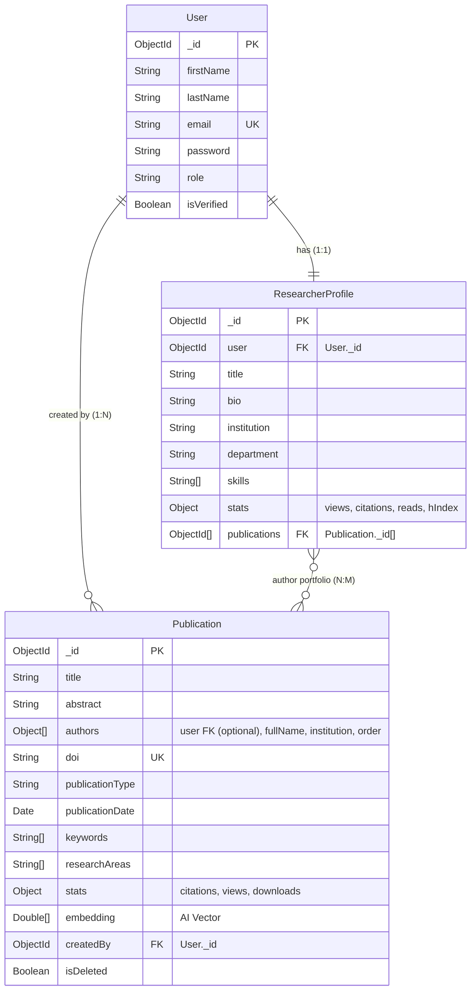

# Research Connect — Database Schema Documentation

This document describes the complete database architecture for the **Research Connect** platform. It outlines the collections, fields, validations, relationships, and indexing strategies used across the database.

---

## 🏛️ General Database Design Principles

To ensure scalability, performance, and compatibility for millions of research records, all collections strictly adhere to the following rules:
1. **Naming Conventions**: Collections use `snake_case` (e.g. `researcher_profiles`), and Mongoose models use `PascalCase` (e.g. `ResearcherProfile`).
2. **Timestamps**: All schemas have `timestamps: true` enabled, automatically creating `createdAt` and `updatedAt` fields.
3. **Soft Deletion**: Crucial collections support soft deletes through `isDeleted`, `deletedAt`, and `deletedBy` fields.
4. **Audit Support**: Standard collections track authorship through `createdBy` and `updatedBy` fields.
5. **Relationships**: Normalized references (`ObjectId`) are preferred over duplicate embedded records unless optimized for read-heavy caching.
6. **Indexing**: Performance-critical query paths (filtering, sorting, and text searches) are covered by targeted indexes.

---

## 📊 Entity Relationship Diagram (ERD)



---

## 🗄️ Collections

### 1. `users`

* **Model Name**: `User`
* **Purpose**: Manages user accounts, authorization roles, authentication state, and token lifecycles.

#### Schema Fields Table
| Field Name | Type | Required | Defaults | Validations & Constraints | Description |
| :--- | :--- | :---: | :--- | :--- | :--- |
| `_id` | ObjectId | Yes | Generated | Auto-generated by MongoDB | Primary key. |
| `firstName` | String | Yes | — | Trimmed | The user's first name. |
| `lastName` | String | Yes | — | Trimmed | The user's last name. |
| `email` | String | Yes | — | Unique, lowercase, trimmed, email regex | Email address used for authentication. |
| `password` | String | Yes | — | Min-length: 6, `select: false` (hidden by default) | BCrypt hashed password string. |
| `role` | String | Yes | `'researcher'` | Enum: `['researcher', 'admin']` | User access level for routing gates. |
| `isVerified` | Boolean | Yes | `false` | — | True if email has been verified. |
| `verificationToken` | String | No | — | — | Token sent to verify email address. |
| `verificationTokenExpires`| Date | No | — | — | Expiration timestamp of verification token. |
| `passwordResetToken` | String | No | — | — | Token used for password recovery. |
| `passwordResetExpires` | Date | No | — | — | Expiration timestamp of reset token. |
| `refreshToken` | String | No | — | `select: false` | Store active refresh token for session refresh. |

#### Indexes
* `email`: `1` (Unique index for high-speed user lookups and authentication verification).

#### Example Document
```json
{
  "_id": "60c72b2f9b1d8b23c4d4f701",
  "firstName": "Alice",
  "lastName": "Smith",
  "email": "alice.smith@university.edu",
  "role": "researcher",
  "isVerified": true,
  "createdAt": "2026-06-30T18:49:26.000Z",
  "updatedAt": "2026-06-30T19:27:51.000Z"
}
```

---

### 2. `researcher_profiles`

* **Model Name**: `ResearcherProfile`
* **Purpose**: Stores academic portfolios, affiliations, citations, external links, and references to researcher publications.

#### Schema Fields Table
| Field Name | Type | Required | Defaults | Validations & Constraints | Description |
| :--- | :--- | :---: | :--- | :--- | :--- |
| `user` | ObjectId | Yes | — | Unique, Reference to `User` | Maps the profile 1:1 to a user account. |
| `title` | String | No | `""` | Trimmed | Academic/Professional title (e.g. Associate Professor). |
| `bio` | String | No | `""` | Trimmed, Max-length: 500 | Short summary bio. |
| `institution` | String | No | `""` | Trimmed | Institutional affiliation (e.g. Stanford University). |
| `department` | String | No | `""` | Trimmed | Department affiliation (e.g. Computer Science). |
| `skills` | [String] | No | `[]` | — | Expertise areas (e.g. `['NLP', 'Deep Learning']`). |
| `socialLinks` | Object | No | `{}` | Subdocument schema | Academic research profiles links. |
| `socialLinks.orcid` | String | No | `""` | Trimmed | ORCID identifier string. |
| `socialLinks.googleScholar` | String | No | `""` | Trimmed | Google Scholar profile link. |
| `socialLinks.researchGate` | String | No | `""` | Trimmed | ResearchGate profile link. |
| `socialLinks.linkedin` | String | No | `""` | Trimmed | LinkedIn profile link. |
| `socialLinks.website` | String | No | `""` | Trimmed | Personal homepage URL. |
| `stats` | Object | Yes | `{}` | Subdocument schema | Cached stats for dashboard visualizations. |
| `stats.views` | Number | Yes | `0` | Min: 0 | Profile view count. |
| `stats.citations`| Number | Yes | `0` | Min: 0 | Total citation count (synced from Scholar/Scopus). |
| `stats.reads` | Number | Yes | `0` | Min: 0 | Total publication reads. |
| `stats.hIndex` | Number | Yes | `0` | Min: 0 | Calculated h-index metric. |
| `publications` | [ObjectId] | No | `[]` | Reference to `Publication` array | List of publications authored by this researcher. |
| `coAuthors` | [ObjectId] | No | `[]` | Reference to `User` array | References to registered platform co-authors. |

#### Indexes
* `institution`: `1` (Allows rapid directory filtering by universities/companies).
* `skills`: `1` (Allows rapid search of specialists based on expertise).

#### Example Document
```json
{
  "_id": "60c72b2f9b1d8b23c4d4f802",
  "user": "60c72b2f9b1d8b23c4d4f701",
  "title": "Associate Professor of Computer Science",
  "bio": "Doing research in Deep Learning and Natural Language Processing.",
  "institution": "Stanford University",
  "department": "Computer Science",
  "skills": ["Deep Learning", "NLP", "Python"],
  "socialLinks": {
    "orcid": "0000-0001-2345-6789",
    "googleScholar": "https://scholar.google.com/citations?user=alice",
    "linkedin": "https://linkedin.com/in/alicesmith"
  },
  "stats": {
    "views": 150,
    "citations": 4200,
    "reads": 1050,
    "hIndex": 18
  },
  "publications": [
    "60c72b2f9b1d8b23c4d4f8a1"
  ],
  "coAuthors": [],
  "createdAt": "2026-07-01T05:37:39.000Z",
  "updatedAt": "2026-07-01T05:37:39.000Z"
}
```

---

### 3. `publications`

* **Model Name**: `Publication`
* **Purpose**: Stores individual research articles, preprints, books, patents, citations, and semantic vector data.

#### Schema Fields Table
| Field Name | Type | Required | Defaults | Validations & Constraints | Description |
| :--- | :--- | :---: | :--- | :--- | :--- |
| `title` | String | Yes | — | Trimmed | The title of the paper. |
| `abstract` | String | No | `""` | Trimmed | Summary abstract of the paper. |
| `authors` | [Object] | Yes | — | Min-length: 1, Sub-schema | Ordered array of authors. |
| `authors.user` | ObjectId | No | — | Reference to `User` | Reference link if the author is registered on platform. |
| `authors.fullName`| String | Yes | — | Trimmed | Display name of the author on the publication. |
| `authors.institution`| String | No | `""` | Trimmed | Affiliated institution of the author. |
| `authors.order` | Number | Yes | — | Min: 1 | Ordered sequence (1 for first author, etc.). |
| `doi` | String | No | — | Unique, sparse, lowercase, DOI regex | Digital Object Identifier. |
| `publicationType`| String | Yes | `'journal'` | Enum: `['journal', 'conference', 'book', 'preprint', 'patent', 'other']` | Type classification of the publication. |
| `journal` | String | No | `""` | Trimmed | Journal publication venue. |
| `conference` | String | No | `""` | Trimmed | Conference publication venue. |
| `publisher` | String | No | `""` | Trimmed | Publishing house or provider. |
| `publicationDate`| Date | Yes | — | — | Date of official publication release. |
| `volume` | String | No | `""` | Trimmed | Volume number. |
| `issue` | String | No | `""` | Trimmed | Issue number. |
| `pages` | String | No | `""` | Trimmed | Page numbers range. |
| `url` | String | No | `""` | URL regex | Publisher landing page link. |
| `pdfUrl` | String | No | `""` | URL regex | Link to download the PDF file. |
| `keywords` | [String] | No | `[]` | — | Keyword index tags for retrieval. |
| `researchAreas` | [String] | No | `[]` | — | Academic domain subjects (e.g. `['Systems']`). |
| `stats.citations`| Number | Yes | `0` | Min: 0 | Number of times this paper has been cited. |
| `stats.views` | Number | Yes | `0` | Min: 0 | Metrics: view counts. |
| `stats.downloads`| Number | Yes | `0` | Min: 0 | Metrics: PDF download counts. |
| `embedding` | [Number] | No | — | — | AI generated semantic text vector array. |
| `embeddingModel`| String | No | — | Trimmed | Model ID (e.g. `text-embedding-3-small`). |
| `aiMetadata` | Mixed | No | `{}` | — | AI parser insights and confidence scores. |
| `processedAt` | Date | No | — | — | Timestamp of embedding generation. |
| `vectorVersion` | String | No | — | Trimmed | Re-indexing schema configuration tags. |
| `createdBy` | ObjectId | Yes | — | Reference to `User` | User who created this publication entry. |
| `updatedBy` | ObjectId | No | — | Reference to `User` | User who last updated this publication entry. |
| `isDeleted` | Boolean | Yes | `false` | — | Soft deletion indicator flag. |
| `deletedAt` | Date | No | — | — | Soft deletion timestamp. |
| `deletedBy` | ObjectId | No | — | Reference to `User` | User who soft-deleted this record. |

#### Indexes
* `keywords`: `1` (Enables tag based paper filters).
* `researchAreas`: `1` (Enables classification filtering).
* `publicationType`: `1` (Venue filters).
* `publicationDate`: `-1` (Fast sorting by date).
* `stats.citations`: `-1` (Fast sorting by citation counts / popularity).
* `isDeleted`: `1` (Exclude deleted papers from active searches).
* `doi`: `1` (Unique, sparse index, ignoring null/missing entries).
* `authors.user`: `1` (Fast resolution of registered user authorship).
* **Text Index** on `{ title: 'text', abstract: 'text', keywords: 'text' }` (Weighted: `title: 10`, `keywords: 5`, `abstract: 1` for global search bar).

#### Example Document
```json
{
  "_id": "60c72b2f9b1d8b23c4d4f8a1",
  "title": "Attention Is All You Need",
  "abstract": "We propose a new simple network architecture, the Transformer...",
  "authors": [
    {
      "user": "60c72b2f9b1d8b23c4d4f701",
      "fullName": "Ashish Vaswani",
      "institution": "Google Brain",
      "order": 1
    },
    {
      "fullName": "Noam Shazeer",
      "institution": "Google Brain",
      "order": 2
    }
  ],
  "doi": "10.48550/arxiv.1706.03762",
  "publicationType": "preprint",
  "publicationDate": "2017-06-12T00:00:00.000Z",
  "url": "https://arxiv.org/abs/1706.03762",
  "pdfUrl": "https://arxiv.org/pdf/1706.03762.pdf",
  "keywords": ["attention", "transformer", "nlp"],
  "researchAreas": ["Computer Science", "Artificial Intelligence"],
  "stats": {
    "citations": 120531,
    "views": 450200,
    "downloads": 310500
  },
  "embedding": [0.0125, -0.0045, 0.0892],
  "embeddingModel": "text-embedding-3-small",
  "aiMetadata": {
    "extractionConfidence": 0.98,
    "primaryKeywords": ["transformer", "deep learning"]
  },
  "processedAt": "2026-07-01T11:11:00.000Z",
  "vectorVersion": "v1",
  "createdBy": "60c72b2f9b1d8b23c4d4f701",
  "isDeleted": false,
  "createdAt": "2026-07-01T11:11:00.000Z",
  "updatedAt": "2026-07-01T11:11:00.000Z"
}
```
