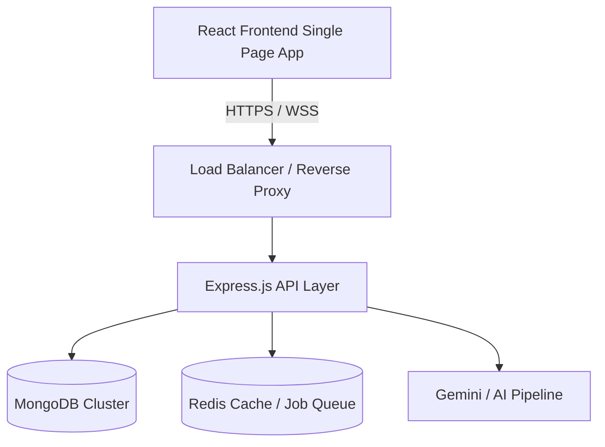
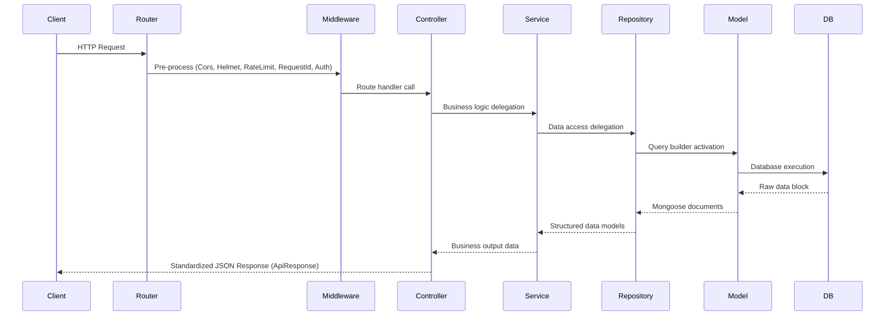
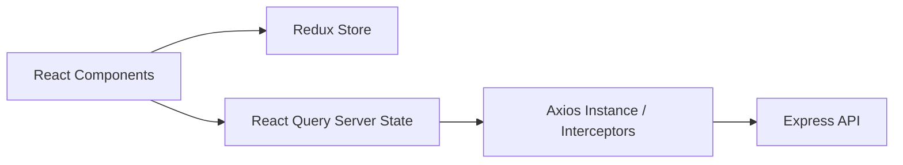

# Research Connect — Architecture Guide

This document outlines the high-level architecture of **Research Connect**, an enterprise-grade SaaS platform designed to scale to millions of users, publications, and real-time AI recommendation feeds.

---

## 🏛️ Overall System Architecture

Research Connect is built on a modern **MERN (MongoDB, Express, React, Node.js) Stack** and utilizes a decoupled, feature-first design pattern to ensure plug-and-play modularity.

---

## 💻 Backend Architecture

The backend follows a strict **Feature-First Layered Architecture** combining MVC, Repository Pattern, and Service Layer patterns.

### Key Layers:
1. **Routing Layer**: Receives HTTP requests, maps them to controllers, and applies route-specific validation schemas.
2. **Controller Layer**: Handles API requests, extracts request payloads, delegates to the Service Layer, and sends standard responses. It contains NO business or database queries.
3. **Service Layer**: House of business rules, validation logic, transaction handling, and third-party API orchestrations.
4. **Repository Layer**: Encapsulates all database interactions. Provides an abstraction over Mongoose models so the service layer is decoupled from database-specific operations.
5. **Model Layer**: Defines Mongoose schemas, types, validations, and index boundaries.

---

## 🎨 Frontend Architecture

The React frontend utilizes **Vite** for fast builds, **Redux Toolkit** for sync state management, **React Query (TanStack Query)** for async server state cache, **Axios** for interceptor-based api calls, and **Tailwind CSS** for UI layouts.

### State Management Separation:
- **Client Sync State (Redux)**: Global settings like dark mode themes, navigation menus, and simple notifications/toasts.
- **Server Async State (React Query)**: Caches queries, handles pre-fetching, invalidates state on mutations, and reduces round-trip network overhead.
